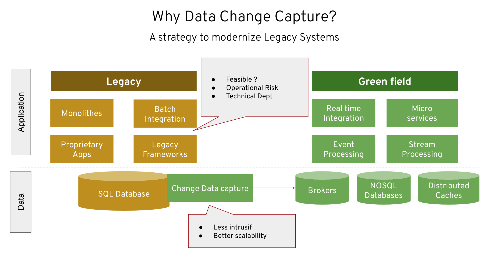
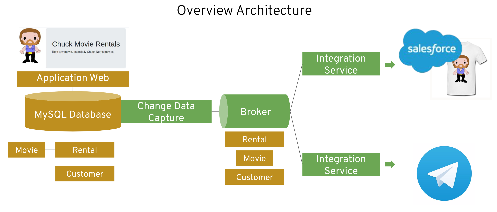

# Chuck Norris streams demonstration

## Introduction

This repository is a demonstration of Change Data Capture and Stream Processing capabilities on OpenShift Kubernetes platform. Our -fictionnal- use-case is to enhance an existing Movie Rental application that is specialized into Chuck Morris movies ;-) We have 2 goals for this app and we will focus our effort on customer who rent Chuck movies only:
* Enhance customer relationship and knowledge through the usage of Salesforce CRM,
* Enhance customer experience by starting interacting and sending fun facts about Chuck Norris through Telegram.

In order to implement these enhancement, we want to leave the existing app unchanged and will process by adding new capabilities around the existing components. We will use Change Data Capture for that as it is a really powerfull pattern that lowers the operational risks and implementation issues and provides a scalable and non-intrusive solution. Change Data Capture is really helpful for extracting events from browfield applications and store this events into a log or a broker. Then we can easily add new greenfield feataures by leveraging integration capabilities and using modern patterns like Stream Processing and Microservices.



For this demonstration, we have used:
* [Debezium](https://debezium.io) that run into Kubernetes, capture database events and send them to a [Kafka](http://kafka.apache.org) broker, 
* [AMQ Streams / Strimzi](https://www.redhat.com/en/technologies/jboss-middleware/amq) as a Kafka distribution optimized for Kubernetes,
* [Fuse Online / Syndesis](https://www.redhat.com/en/technologies/jboss-middleware/fuse-online) as a Kubernetes iPaaS that makes it easy to configure real-time integrations.

Click on the image below to start the video!

[](https://github.com/lbroudoux/chuck-norris-streams/blob/master/assets/chuck-demo.mp4?raw=true)

## Architecture

The schema just below represents an overview of the application architecture. We have existing brownfield components on the very left and we add all the green components for implementing the new capabilities. 



## Pre-requisites

Before starting the setup of this demonstration, you'll need some pre-requisites:
* An [OpenShift Container Platform](https://www.openshift.com) cluster with the 3.11.x version installed,
* A valid AMQ Streams installation on top of your OpenShift cluster. We've used release 1.1 of AMQ Streams that comes from Red Hat Integration 7.3. See [setup instructions](https://access.redhat.com/documentation/en-us/red_hat_amq/7.3/html-single/using_amq_streams_on_openshift_container_platform/index). Strimzi (http://strimzi.io) community project can also be used as replacement, Strimzi being the upstream community project of AMQ Streams. For the rest of this demonstration, we assume the broker is available with the `amq-streams` namespace,
* A valid Fuse Online installation on top of your OpenShift cluster, We've used the one that comes from Red Hat Integration 7.3. See [setup instructions](https://access.redhat.com/documentation/en-us/red_hat_fuse/7.3/html/integrating_applications_with_fuse_online/fuse-online-on-ocp_ug). Syndesis (http://syndesis.io) community project can also be used as replacement, Syndesis being the upstream community project of Fuse Online. For the rest of this demonstration, we assume it has been deployed into `fuse-online` namespace,
* A SalesForce developer account. See https://developer.salesforce.com,
* A Telegram account. See https://web.telegram.org.

You should also have the `oc` client line interface tool installed on your machine. Pick the corresponding OpenShift version from [this page](https://github.com/openshift/origin/releases). Whilst I have deployed and tested everything on an OpenShift 3.11 cluster.

## Install components

Whilst AMQ Streams and Fuse Online may be installed into their own namespace/project, we'll recommend setting up a new project for hosting the components of this demonstration:

```
oc new-project chuck-movie-rental --dsiplay-name='Chuck Movie Rental'
```

### Deploy base components

First component is a simple Mysql database. For that we'll use the preconfigured `example-mysql` container image coming from the Debezium project ; all the required configuration for binary logs being done onto this iamge.

```
# Deploy database on OpenShift
oc new-app --name=mysqldebezium debezium/example-mysql:0.8 -l app=rental-service -n chuck-movie-rental
```

We'll also have to set specific credentials for the database access.

```
# Configure credentials for the database
oc env dc/mysqldebezium MYSQL_ROOT_PASSWORD=password MYSQL_USER=chuck MYSQL_PASSWORD=password -n chuck-movie-rental
```

Now, we'll have to deploy the application allowing to expose GUI and API for our movie online store. For that, just clone the Git repository, be sure to use the newly created `chuck-movie-rental` project and launch the Maven task that will build locally the project and than interact with OpenShift for you to get a new running pod:

```
git clone https://github.com/lbroudoux/chuck-norris-streams.git
cd chuck-norris-streams/rental-service
oc project chuck-movie-rental
mvn -Pk8s clean fabric8:deploy 
```

Finally, we'll deploy a copy of the Chuck Norris Random Facts API. A copy with just fair, non discrimant facts and citations from the original one.

```
cd ../chuck-norris-facts-api
oc project chuck-movie-rental
mvn -Pk8s clean fabric8:deploy 
```

#### Check base components deployment

After all the previous builds and deployments succeeds, you should end up with something like this:

```
$ oc get pods
NAME                                           READY     STATUS      RESTARTS   AGE
chuck-norris-facts-api-1-5zqvj                 1/1       Running     1          1d
chuck-norris-facts-api-s2i-1-build             0/1       Completed   0          1d
mysqldebezium-2-mf46w                          1/1       Running     2          1d
rental-service-1-6njpn                         1/1       Running     1          1d
rental-service-s2i-1-build                     0/1       Completed   0          1d
```

Given the `mysqldebezium-2-mf46w` pod that hosts our database, we should be able to remote connect to the pod, connect the Mysql database and check that database schema has been correctly updated after the `rental-service` component startup:

```
$ oc rsh mysqldebezium-2-mf46w
$ mysql -u root -ppassword inventory
mysql: [Warning] Using a password on the command line interface can be insecure.
Reading table information for completion of table and column names
You can turn off this feature to get a quicker startup with -A

Welcome to the MySQL monitor.  Commands end with ; or \g.
Your MySQL connection id is 1836
Server version: 5.7.25-log MySQL Community Server (GPL)

Copyright (c) 2000, 2019, Oracle and/or its affiliates. All rights reserved.

Oracle is a registered trademark of Oracle Corporation and/or its
affiliates. Other names may be trademarks of their respective
owners.

Type 'help;' or '\h' for help. Type '\c' to clear the current input statement.

mysql> show tables;
+---------------------+
| Tables_in_inventory |
+---------------------+
| customer            |
| movie               |
| rental              |
+---------------------+
3 rows in set (0.00 sec)

mysql>
```

From this CLI you are now able to insert some information into the tables, like the one provided into `rental-service/src/main/resources/sql/examples.sql` within this repository.

You should also be able to expose the `rental-service` and the `chuck-norris-facts-api` Pod and Service to OpenShift routes:

```
$ oc expose svc/rental-service
$ oc expose svc/chuck-norris-facts-api
$ oc get routes
NAME                        HOST/PORT                                                          PATH      SERVICES                    PORT      TERMINATION   WILDCARD
chuck-norris-facts-api      chuck-norris-facts-api-chuck-movie-rental.apps.x.x.x.x.nip.io                chuck-norris-facts-api      8080                    None
rental-service              rental-service-chuck-movie-rental.apps.x.x.x.x.nip.io                        rental-service              8080                    None
```

### Deploy Debezium Change Data Capture

In order to transform any change applied to the Database into events onto Kafka topics, we'll use [Debezium](http://www.debezium.io) Change Data Capture. Debezium is implemented using Kafka-connect framework. It listens your database binary logs and transform each UPSERT or DELETE into an event with JSON payload representing the data before and after the operation occurs. 

We'll setup a Debezium connector for `mysqldebezium` database that will push events to 3 topics named `dbserver1.inventory.customer`, `dbserver1.inventory.movie` and `dbserver1.inventory.rental`. All detailed instructions are given into [cdc-config](./cdc-config.md).

### Deploy Kafka Streams filter

Our purpose for this use-case is to detect each movie rental where the movie main actor is `Chuck Norris` ;-) and then to trigger integration routes for adding new Contact into Salesforce and chatting on Telegram. In order to detect the correct events and filter those of interest for us, we are using Kafka Stream framework for writing a new component. 

We'll setup a new component called `chuck-norris-filter-kstreams` that will listen to the 3 topics provided by Debezium. This component will filter out the new rental events and produce JSON aggregated payload on a new `rental-chuck-norris` topic. All detailed instructions given into [kstream-config](./kstream-config.md).

### Deploy Fuse Online integration routes

All detailed instructions given into [fuse-online](./fuse-online.md).

## Run the demo

Running the demo is just easy:
* Connect to the frontend `rental-service` route and through the GUI proceed to customer authentication (you'll only need customer identifier),
* Browse movies from catalog and rent movies:
    * Renting a movie where main actor IS NOT Chuck Norris will no do anything special
    * Renting a movie where main actor IS Chuck Norris will produce a new Contact in Salesforce and a new Telegram message

Depending on the initilaization sequence of components, it is possible the `chuck-norris-filter-kstreams` did not react and create new rental on the target topic. In that case, you may have to connect to the `mysqldebezium` database and simulate update of customers and movies in order to refresh the KTables uesd by the component.

You may want to use this following SQL snippets for that :
```
update movie set main_actor='Jessica Lange ' where id =1;
update movie set main_actor='Chuck Norris ' where id =2;
update movie set main_actor='Anthony Hopkins ' where id =3;
update movie set main_actor='Chuck Norris ' where id =4;
update movie set main_actor='Chuck Norris ' where id =5;
update movie set main_actor='Roger Miller ' where id =6;
update movie set main_actor='Charles Chaplin ' where id =7;
update movie set main_actor='Chuck Norris ' where id =8;
update movie set main_actor='James Stewart ' where id =9;

update customer set last_name='pham ' where id =1;
update customer set last_name='broudoux ' where id =2;

update movie set main_actor='Jessica Lange' where id =1;
update movie set main_actor='Chuck Norris' where id =2;
update movie set main_actor='Anthony Hopkins' where id =3;
update movie set main_actor='Chuck Norris' where id =4;
update movie set main_actor='Chuck Norris' where id =5;
update movie set main_actor='Roger Miller' where id =6;
update movie set main_actor='Charles Chaplin' where id =7;
update movie set main_actor='Chuck Norris' where id =8;
update movie set main_actor='James Stewart' where id =9;

update customer set last_name='pham' where id =1;
update customer set last_name='broudoux' where id =2;
```