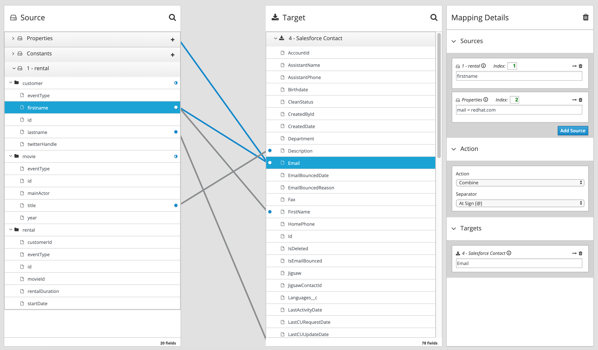
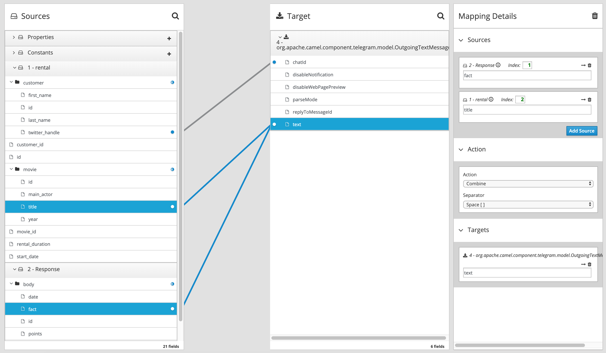

# Connectors setup

## Salesforce

As described on [Connecting to Salesforce](https://access.redhat.com/documentation/en-us/red_hat_fuse/7.3/html-single/connecting_fuse_online_to_applications_and_services/index#connecting-to-sf_connectors), create a new Connector to SalesForce into your Fuse Online/Syndesis  instance.

## Telegram

As described on [Connecting to Telegram](https://access.redhat.com/documentation/en-us/red_hat_fuse/7.3/html-single/connecting_fuse_online_to_applications_and_services/index#connecting-to-telegram_connectors), create a new Connector to Telegram into your Fuse Online/Syndesis instance.

## Chuck Norris Facts API

From the `Customizations` page, create a new API Connector by drag-and-dropping the `chuck-norris-facts-api-swagger.yaml` file at the root of this repository. This API will be called `chuck-norris-facts-api`. 

You will have then to create a new `Connection` using this connector and adpting the Host for this API connector depending on the route you create for `chuck-norris-facts-api` component on OpenShift.

## Develop & deploy integration routes

### Input events model

As decribed into [README.md](README.md), events for integration routes are coming from the `rental-chuck-norris` Kafka topic and are a simple aggregate of the 3 entities. Here's a sample to use for the routes configuration :

```
{
  "rental": {
    "id": 1,
    "user_id": 1,
    "movie_id": 1,
    "start_date": "2019-05-16",
    "rental_duration": 3
  },
  "movie": {
    "id": 1,
    "title": "The Delta Force",
    "year": 1986,
    "main_actor": "Chuck Norris"
  },
  "customer": {
    "id": 1,
    "first_name": "Laurent",
    "last_name": "Broudoux",
    "twitter_handle": "@lbroudoux"
  }
}
```

### Kafka rental-chuck-norris to Salesforce

Start creating a new integration route from Fuse Online home page. Call it `process-chuck-rentals-sf` for example. You can also import a zip archive built from the `./fuse-online-routes/process-chuck-rentals-sf-lbr-export` directory within this repository.

This route should have:
* A starting Kafka connection to your broker, listening on `rental-chuck-norris` topic,
* A ending Salesforce connection, creating `Contact` entities, the ID being the email address of contact.
* A DataMapping step between the two, applying the following mapping rules. We have to build a valid Email address for Salesforce object by appending a property:



Once completed, you can now publish the integration route.


### Kafka rental-chuck-norris to Telegram

Then create a new integration route from Fuse Online home page. Call it `rental-event-to-telegram` for example. You can also import a zip archive built from the `./fuse-online-routes/rental-event-to-telegram-lbr-export` directory within this repository.

This route should have:
* A starting Kafka connection to your broker, listening on `rental-chuck-norris` topic,
* A ending Telegram connection using the specific `Chat ID` you may have collected when creating the connector.
* A Connection to the `chuck-norris-facts-api` you previously created, calling the `GET /restsvc/fact` endpoint,
* A DataMapping step between the two, applying the following mapping rules between `1 - rental` coming from the Kafka topic and `2 - Response` coming from the API connector on the left ; and the simple Telegram object on the right:



Once completed, you can now publish the integration route.
